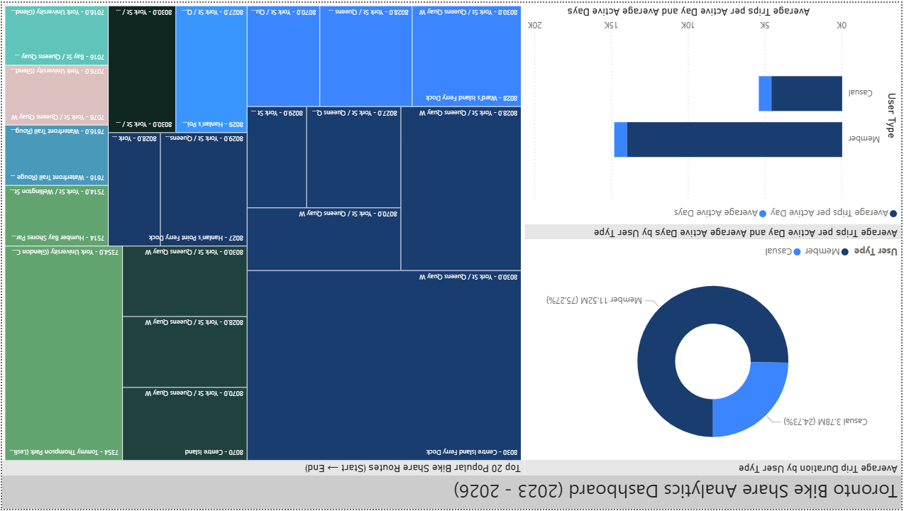

# Toronto Bike Share Analytics Pipeline

A modern end-to-end data analytics pipeline for Toronto Bike Share ridership data. This project automates ingestion, transformation, and analytics using Google Cloud Platform (GCP), dbt, Kestra, Terraform, and Power BI.

## Project Overview

This pipeline collects Toronto Bike Share trip data from the City of Toronto open data portal and transforms it into analytics-ready datasets using a modern ELT architecture.

It is designed to demonstrate production-grade data engineering practices including orchestration, data warehousing, transformations, testing, and visualization.

**Key Features:**
- Automated ingestion from Toronto Open Data API
- Scalable cloud architecture on Google Cloud Platform (GCP)
- Batch orchestration using Kestra
- Data warehouse built on BigQuery
- Modular transformations using dbt
- Data quality testing and lineage tracking
- Infrastructure as Code using Terraform
- Power BI dashboard for business insights

## Architecture Overview

This project implements a batch ELT architecture:

```
Toronto Open Data API
        ↓
   Kestra Orchestration
        ↓
Google Cloud Storage (Raw Data Lake)
        ↓
   Google BigQuery (Raw Layer)
        ↓
     dbt Transformations
        ↓
 Staging → Intermediate → Marts
        ↓
  Analytics & Power BI Dashboard
```

### Cloud & Infrastructure (GCP + Terraform)

All infrastructure is provisioned using Terraform on Google Cloud Platform.

#### Provisioned Resources
    - **Google Cloud Storage Bucket**
      - Stores raw Parquet files
      - Path: gs://toronto-bike-share-bucket/raw/{year}
    - **BigQuery Dataset**
      - Dataset: bikeshare_raw_dataset
      - Stores raw and transformed tables

#### Infrastructure as Code Benefits
     - Fully reproducible environment
     - Version-controlled infrastructure
     - Easy deployment across environments

### Orchestration (Kestra)

Kestra manages the full ingestion pipeline via a batch workflow.

#### Pipeline Steps
   1. **Download & Extract**
      - Fetch yearly ZIP data from Toronto Open Data API
      - Extract CSV files
      - Clean and standardize schema
      - Convert to Parquet format
   2. **Upload to GCS**
      - Store processed Parquet files in Cloud Storage
   3. **BigQuery Raw Load**
      - Create raw ingestion tables
      - Load external tables from GCS
   4. **Transformation Staging**
      - Load and normalize data types
      - Apply schema validation
   5. **Merge Layer**
      - Deduplicate records
      - Perform incremental merge into final raw table
   6. **Cleanup**
      - Remove temporary files
      - Clear execution artifacts

### Data Warehouse Design (BigQuery + dbt)

The data warehouse is implemented using a multi-layer dbt architecture:

Staging Layer
- Performs type casting and schema normalization
- Handles null standardization
- Applies base-level data cleaning

Intermediate Layer
- Generates surrogate trip identifiers
- Applies deduplication logic
- Implements business logic flags for ride behavior

Marts Layer
- Builds analytical dimensions and fact models for reporting

Dimension models:
- dim_stations
- dim_user_types
- dim_bike_models

Fact model:
- fct_trips

Reporting Models
- member_engagement_matrics
- trip_flow_summary

These models are designed to power dashboard and visualization use cases.

#### Fact Table: fct_trips

**The central fact table includes**:
- Unique ride identifiers and station/location foreign keys
- Trip duration (calculated in minutes from start_time and end_time)
- Station details (start and end station IDs and names)
- Bike and user type dimension keys (bike_model_id, user_type_id)

***Modeling Strategy**:
- Materialization: Incremental model (append + merge strategy) using trip_id as the unique key
- Partitioning: By start_time (monthly partitions)
- Clustering: By user_type_id and bike_model_id for query optimization

### dbt Transformations

**Transformations Features**:
- Source definitions with documentation and lineage tracking
- Staging layer standardization (NULLIF handling, type casting, timestamp normalization)
- Intermediate logic for ride classification (pickup_type / dropoff_type)
- Fact and dimension joins in marts layer
- Incremental loading in fct_trips to avoid full table rebuilds on each run
- Performance optimization in BigQuery using partitioning and clustering in fct_trips
- Data quality enforcement across intermediate and marts layers

**Data Quality Tests**:
- not_null, unique
- relationships (referential integrity across dimensions)
- accepted_values (controlled domain constraints)

### Analytics & Dashboard Layer

The Power BI dashboard provides insights into bike share usage patterns.

**Current Project State**:
- Warehouse models and data quality tests are fully implemented
- Two reporting tiles are actively connected to the warehouse outputs: operational_map_tile and membership_behaviour_tile
- Dashboard file is included under the Dashboard/ directory



## Project Structure

```
toronto-bike-share-analytics-pipeline/
├── dbt/                          
│   └── dbt-bikeshare/
│       ├── models/
│       │   ├── staging/          
│       │   │   ├── stg_bikeshare_data.sql
│       │   │   └── sources.yml
│       │   ├── intermediate/     
│       │   │   └── int_bikeshare_trips.sql
│       │   └── marts/            
│       │       ├── dim_bike_models.sql
│       │       ├── dim_stations.sql
│       │       ├── dim_user_types.sql
│       │       ├── fct_trips.sql
│       │       └── reporting/    
│       │           ├── member_engagement_metrics.sql
│       │           └── trip_flow_summary.sql
│       ├── macros/               
│       │   ├── get_bike_model.sql
│       │   └── get_user_type.sql
│       └── dbt_project.yml       
│
├── kestra/                        
│   ├── gcp_bikeshare_pipeline.yaml  
│   ├── docker-compose.yaml        
│   └── gcp_kv.yaml               
│
├── terraform/                    
│   ├── main.tf                   
│   ├── variables.tf              
│   └── terraform.tfstate         
│
├── keys/                         # Credentials (git-ignored)
│   └── my-creds.json
│
├── Dashboard/                    
|   └── Toronto-Bike-Share-Dashboard.pbix
│
└── README.md                     
```

## Getting Started

### Prerequisites

- Docker & Docker Compose
- Terraform (v1.5+)
- Google Cloud Project with:
  - BigQuery API enabled
  - Cloud Storage API enabled
  - Service account with appropriate permissions
- Python 3.10+ (for local dbt development)
- dbt cloud + dbt-bigquery

### Installation

1. **Clone the repository:**
   ```bash
   git clone <repository-url>
   cd Toronto-Bike-Share-Analytics-Pipeline-Project
   ```

2. **Set up GCP credentials:**
   Place your GCP service account JSON in keys/my-creds.json
   ```bash
   keys/my-creds.json
   ```

3. **Initialize Infrastructure (Terraform):**
   From terraform/:
   ```bash
   cd terraform
   terraform init
   terraform plan
   terraform apply
   cd ..
   ```
   This step creates:
   - Google Cloud Storage bucket for raw data lake files
   - BigQuery raw dataset for ingestion output

4. **Start Kestra:**
   ```bash
   cd kestra
   docker compose up -d
   ```
   Kestra UI will be available at `http://localhost:8080`

5. **Run dbt (dbt cloud):**
   ```bash
   cd dbt/dbt-bikeshare
   dbt debug
   dbt deps
   dbt run
   dbt test
   ```
   - Validats connection to BigQuery
   - Builds models and runs tests

6. **Power BI Dashboard:**
   - The dashboard file is available at Dashboard/Toronto-Bike-Share-Dashboard.pbix
   - Open it using Power BI Desktop and configure credentials for your BigQuery project
   - Visuals are powered by dbt marts and reporting models, especially member_engagement_metrics and trip_flow_summary
   - If table names match the dbt project structure, the dashboard will refresh with minimal configuration changes

## Running the Pipeline

### Kestra Web UI
1. Navigate to `http://localhost:8080`
2. Upload `kestra/gcp_bikeshare_pipeline.yaml`
3. Select year from dropdown
4. Click "Execute"
5. Monitor progress in real-time

### Manual dbt Execution
```bash
cd dbt/dbt-bikeshare

# Run all models
dbt run

# Run with freshness checks
dbt build

# Run tests
dbt test
```

## GCP Infrastructure

### Terraform provisions:
- **Cloud Storage Bucket**: `toronto-bike-share-bucket`
  - Raw data location: `gs://toronto-bike-share-bucket/raw/{year}`
  - Lifecycle rule: Deletes incomplete multipart uploads after 1 day
- **BigQuery Dataset**: `bikeshare_raw_dataset`
  - Location: Configurable (default: us-central1)
  - Contains raw bikeshare trip records

## Configuration Files

### Kestra (`gcp_bikeshare_pipeline.yaml`)
- Pipeline ID: `gcp_bikeshare_pipeline`
- Namespace: `dev.bikeshare`
- Inputs: Year selection (2022-2026)
- Tasks: Download, extract, validate, load to BigQuery

### dbt (`dbt_project.yml`)
- Project name: `bikeshare_pipeline`
- Version: `1.0.0`
- Profile: `bikeshare_pipeline`

### Terraform (`main.tf`, `variables.tf`)
- Provider: Google Cloud
- Credentials: Environment variable or file
- Region/Location: Configurable

## Security

- GCP credentials stored in `keys/` (git-ignored)
- Use Kestra secrets management for sensitive variables
- BigQuery dataset access controlled via IAM roles
- Terraform state files git-ignored

## Monitoring & Logging

- Kestra logs: Available in UI and docker logs
- Query logs: `logs/query_log.sql`
- dbt logs: `dbt/dbt-bikeshare/logs/`
- BigQuery audit logs: GCP Console

## Troubleshooting

**Kestra not starting**: Check Docker daemon running; verify ports 8080, 5432 are free |
**BigQuery connection fails**: Verify GCP credentials file path and permissions |
**dbt model fails**: Check `dbt debug`, verify dataset and source references |
**Data not appearing**: Monitor Kestra task logs; check GCS bucket contents |

## Final Notes

This project demonstrates a complete modern data engineering workflow, from raw data ingestion to analytics-ready data modeling and business intelligence. It showcases practical implementation of ELT principles using industry-standard tools such as GCP, dbt, Kestra, Terraform, and Power BI.

The architecture is designed to be modular, scalable, and production-oriented, with a strong emphasis on automation, data quality, and reproducibility.

## Future Enhancements

- Future Enhancements
- Streaming ingestion (Kafka / PubSub)
- Predictive demand forecasting
- Geospatial station clustering & heatmaps
- CI/CD for dbt + Terraform (GitHub Actions)
- Cost monitoring & BigQuery optimization
- Enhanced Power BI interactivity

## Resources

- [Toronto Open Data Catalog](https://open.toronto.ca/dataset/bike-share-toronto-ridership-data)
- [dbt Documentation](https://docs.getdbt.com)
- [Kestra Documentation](https://kestra.io/docs)
- [Terraform Google Provider](https://registry.terraform.io/providers/hashicorp/google)
- [BigQuery Documentation](https://cloud.google.com/bigquery/docs)
